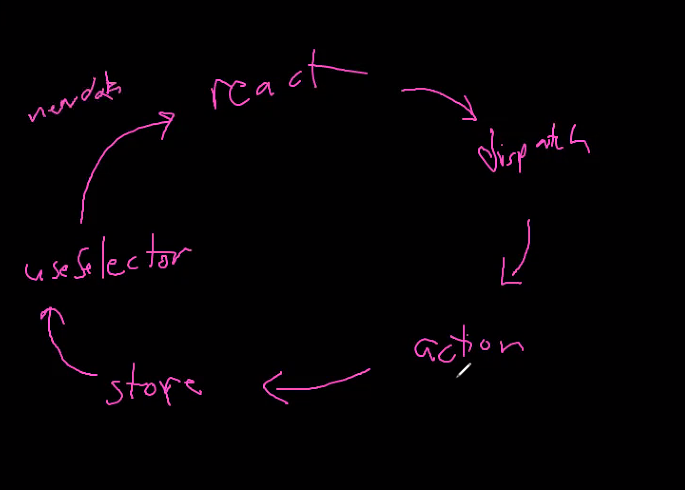
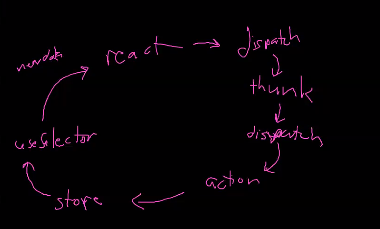

```js // **bold** _italics_ -Bullet Points #<htag value> []task list or []\(task list)```

## Modifying Redux

- The Logger
- Using other kinds of middleware


## What is a thunk?
- Thunks are a form of middleware
## How do thunks work?
- Used to hit routes
- Responsible for fetching, retrieving and transmitting data from Routes.
- Are an alternate solution to helper function files.
- Used to handle Asynchronous functions in Redux.
- Do you need thunks to change the store without fetching?
- No Longer dispatch actions Instead we dispatch Thunks.
- Invoked Inside of the component.
- Thunks Return a function.
- Redux thunk library redifines the dispatch function.

### Syntax
- Import the Thunk library ```import { thunk } from 'react-redux' ```
- Utilize the applmyMiddleware
- 1 Types --> 2 Actions --> 3 Thunks --> 4 Reducer
- Syntax for what the redux-thunk library does 

## How to build a thunk?
1. Create the Function.
2. Create a fetch.
3. Check the response object.
4. If the response is ok abstract your information.
5. If the response is not okay abstract your errors.
6. Dispatch to an action
7. Return to component

```
export const thunkCreate = (dataFromComponent) => async (dispatch, getState) => {
    const res = await fetch("/api/groups")
    if (res.ok) {
        const { Groups } = await res.json(); // { Groups: [], errors: {}}
        dispatch(actionLoadGroups(Groups))
        return Groups // goes to component
    } else {
        const { errors } = await res.json() // { "message" : "", "statusCode": 404}
        return errors // goes to component
    }
}
```

## React-Redux Life Cycle
#### Without Thunks

#### With Thunks

